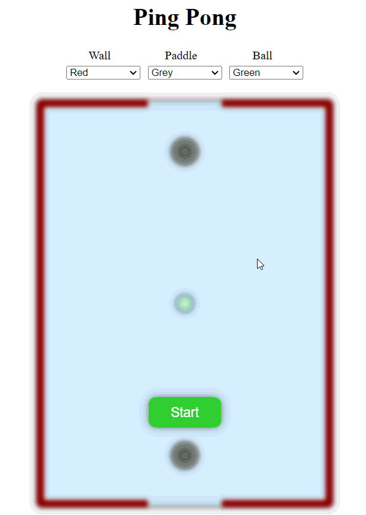

# Ping Pong Game

Welcome to Ping Pong, a classic arcade game built using HTML, CSS, and JavaScript. This project allows players to enjoy the timeless fun of Ping Pong in their web browser.

  

## Features

- **Customizable Colors:** Choose your preferred colors for the walls, paddles, and ball.
- **Responsive Design:** Enjoy seamless gameplay on various screen sizes.
- **Start and Pause:** Begin or pause the game with the click of a button.

## How to Play

1. Open `index.html` in your web browser.
2. Customize the color scheme using the dropdown menus.
3. Click the "Start" button to initiate the game.
4. Use the left and right arrow keys to control the bottom paddle.
5. Press the spacebar to pause or resume the game.

## Getting Started

To run the game locally:

1. Clone this repository to your local machine.
2. Open `index.html` in your preferred web browser.
3. Customize the color scheme using the provided dropdown menus.
4. Enjoy playing Ping Pong!

## Contributing

Contributions are welcome! If you'd like to enhance the game or fix any bugs, feel free to submit a pull request.

## Special Thanks

[Devanshu Wadhwani](https://github.com/Devanshu703) for their valuable contributions.